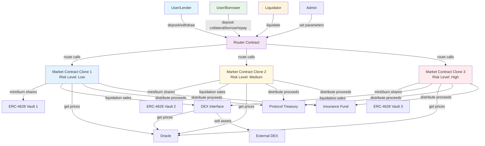

# **DeFi App – Technical Overview**

## 1. Introduction

The **DeFi App** is a decentralized lending and borrowing platform built on smart contracts.
It offers **multiple risk-tiered liquidity pools**, allowing lenders to earn yield and borrowers to access stablecoin liquidity.
Higher-risk pools provide higher potential returns but carry greater volatility and liquidation risk.

---

## 2. Key Features

* **Risk-Tiered Pools** – Multiple markets categorized by risk level. Higher-risk pools pay higher yields.
* **Dynamic Yield** – Depositors earn proportional returns based on pool growth during their staking period.
* **Automated Accruals** – Earnings are updated automatically before every user action.
* **Collateralized Borrowing** – Borrowers deposit volatile assets and receive stablecoins up to a set Loan-to-Value (LTV) ratio.
* **Continuous Interest** – Borrowed funds accrue interest per second until repayment.
* **Efficient Liquidations** – Undercollateralized positions are liquidated via a DEX interface, rewarding liquidators.

---

## 3. User Roles and Core Functions

### 3.1 Lenders

Lenders supply **USDT** (or other supported stablecoins) to earn yield.

**Actions**

* **Deposit Stablecoins** – Provide USDT to a selected market. ERC-4626 shares are minted based on the depositor's proportion of the pool.
* **Claim Earnings** – Withdraw accrued interest at any time.
* **Withdraw Principal** – Redeem stablecoins and burn the corresponding shares.

### 3.2 Borrowers

Borrowers deposit volatile crypto assets (e.g., ETH, AVAX) as collateral.

**Actions**

* **Deposit Collateral** – Lock non-stable assets in a chosen market and accept its terms.
* **Borrow Stablecoins** – Receive stablecoins up to the market's specified LTV ratio.
* **Repay Loan** – Repay principal plus accrued interest to close the loan and reclaim the original collateral.

### 3.3 Platform / Administration

The protocol itself can:

* Set key market parameters such as **interest rate per second**, **liquidation threshold**, and **loan-to-value ratio**.
* Adjust the **reserve factor**.
* Trigger **liquidation** of undercollateralized positions.

---

## 4. Contract Architecture

The platform is composed of modular contracts:

| Component          | Responsibility                                                                        |
| ------------------ | ------------------------------------------------------------------------------------- |
| **Router**         | Main entry point for all user interactions. Forwards calls to the appropriate Market. |
| **Market (Clone)** | Handles lending, borrowing, and liquidations for a specific risk pool.                |
| **ERC-4626 Vault** | Tracks each depositor's share of the pool and handles minting/burning of shares.      |
| **DEX Interface**  | Executes sales of undercollateralized assets during liquidation.                      |

All markets are **clones** of a base implementation to ensure consistent logic and easier upgrades.

### 4.1 Contract Interaction Diagram

### 4.2 Data Flow Summary

1. **User Interactions** flow through the **Router** as the single entry point
2. **Router** forwards calls to the appropriate **Market Contract** based on risk level
3. **Market Contracts** interact with their respective **ERC-4626 Vaults** for share management
4. **Liquidations** are handled through the **DEX Interface** which connects to external markets
5. **Price data** flows from **Oracle** to both Markets and DEX Interface
6. **Liquidation proceeds** are distributed to Treasury, Insurance Fund, and back to Markets

---

## 5. Contract Interactions

### 5.1 Lender Flow

1. **Deposit**

   1. User calls the **Router** to deposit funds into a selected Market.
   2. Funds are transferred to the Market vault.
   3. User accruals are calculated and updated.
   4. ERC-4626 shares are minted and user storage variables updated.

2. **Withdrawal**

   1. User calls the Router with the target Market ID.
   2. The Market verifies available funds.
   3. Accrual is calculated and user variables updated.
   4. Required shares are burned.
   5. Funds are returned to the user's wallet.

3. **Claim Earnings**

   1. User calls the Router to estimate claimable rewards.
   2. If non-zero, user executes a claim transaction.
   3. Rewards are transferred to the user.

### 5.2 Borrower Flow

1. **Deposit Collateral**

   1. Borrower selects a Market.
   2. Calls the Router to deposit collateral and accept terms.
   3. Once confirmed, borrower can draw stablecoins up to the Market's LTV ratio.

2. **Repay Loan**

   1. Borrower provides the loan ID.
   2. Smart contract calculates outstanding principal plus interest.
   3. Borrower repays in full to close the loan.
   4. Original collateral is released.

### 5.3 Liquidator Flow

1. Fetch current market price from an **oracle**.
2. Identify loans within ±0.01% of their liquidation threshold.
3. Call **liquidateLoan** with the loan ID.
4. Collateral is sold via the DEX interface for stablecoins.
5. Proceeds are distributed:

   * **10%** to the liquidator as a fee
   * **40%** to the protocol treasury
   * **10%** to the insurance fund
   * **40%** back to the originating market

---

## 6. Development Roadmap

The development process follows a staged approach:

1. **Define Contract Architecture** – Identify all components and their relationships.
2. **Design Interfaces** – Specify input/output parameters and inherited interface interactions.
3. **Implement Interfaces** – Build and test interface functionality.
4. **Core Development** – Begin smart contract coding.
5. **Unit Testing** – Conduct continuous testing to catch bugs early.
6. **Integrate External Dependencies** – Add oracle price feeds and test in isolation.
7. **End-to-End Testing** – Verify full system behavior.
8. **Event Review** – Ensure sufficient contract events for subgraph indexing.
9. **Deploy to Testnet** – Simulate real-world conditions with block delays.
10. **Write SDK** – Enable seamless frontend and backend integration.
11. **Prepare Subgraph** – Provide analytics and user activity tracking.
12. **Audit Preparation** – Conduct internal reviews and pre-audit checks.
13. **Mainnet Deployment** – Launch the production contracts.

---

### Next Steps

Future iterations may introduce dynamic interest rate models, cross-chain markets, and governance modules to allow token holders to vote on protocol upgrades.